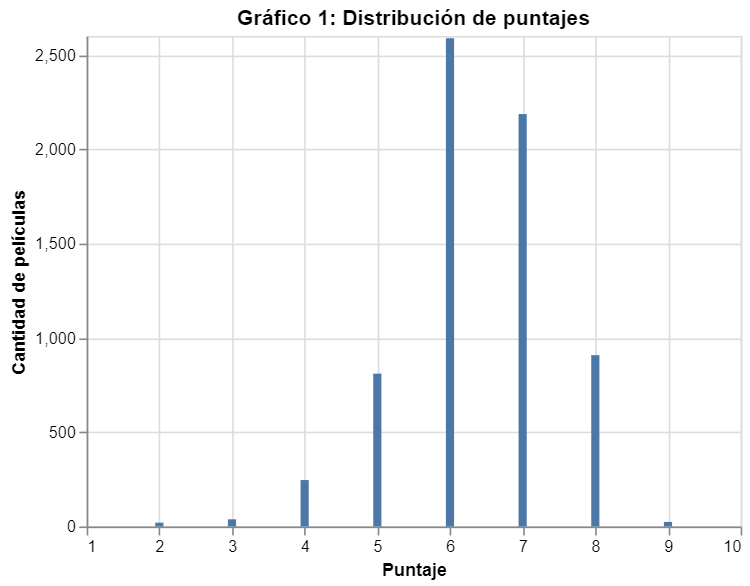
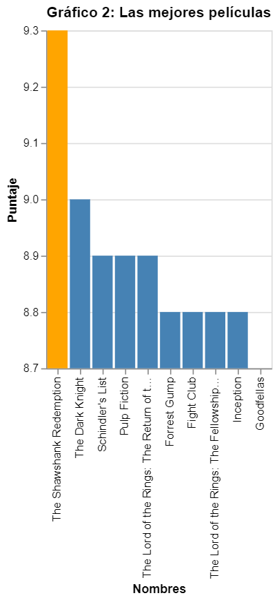
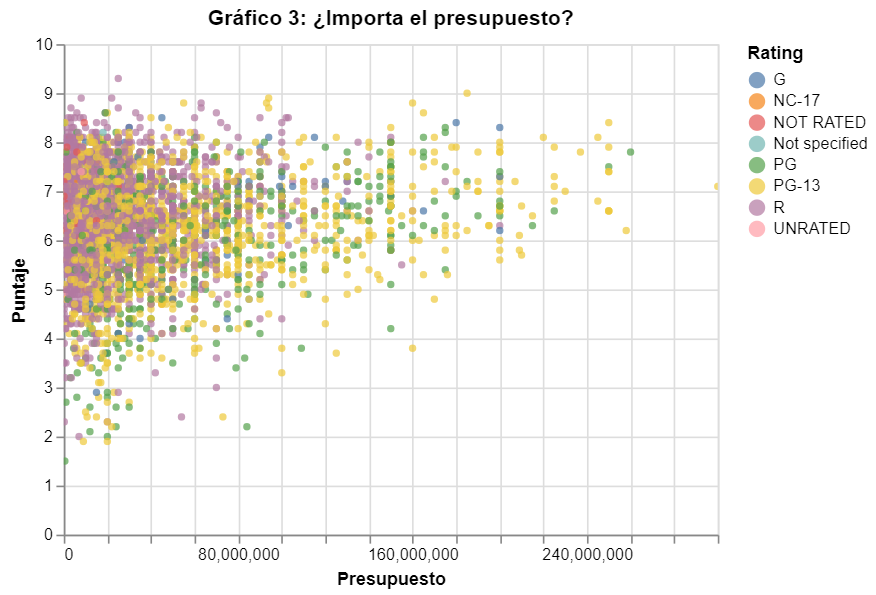
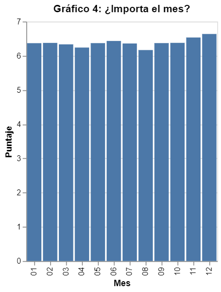
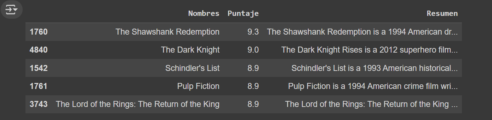

# Movie Data Analysis Project

## Project Overview

This project was developed during the first semester of 2020 as part of the Exploratory Computing course at the Pontificia Universidad Católica de Chile. The main objectives were to learn how to:

- Use Python to manipulate data.
- Visualize data using the Altair library.
- Understand the basic concepts of working with an API.
- Create a simple webpage using HTML, CSS, and JavaScript to display visualizations.

The project analyzes a dataset containing movie information, performs data manipulation and visualization, and integrates API usage to retrieve additional movie details from Wikipedia.

## Project Structure

The project consists of two main parts:

### Part 1: Data Manipulation and Visualization

In this section, a dataset containing movie information is processed using Pandas and visualized using Altair. The following analyses and visualizations are created:

1. Distribution of Movie Scores
A bar chart that displays the number of movies for each rounded average score (from 1 to 10).

2. Top 10 Movies by Score
A bar chart that shows the top 10 movies ranked by score. The highest-rated movie is highlighted in a different color, and movies are displayed in descending order of score.

3. Budget vs. Score
A scatter plot that visualizes the relationship between the movie's budget and its score, excluding movies with a budget of zero. This visualization helps explore whether budget influences the movie's rating.

4. Average Score by Month of Release
A bar chart that shows the average movie score based on the month of release, excluding movies without a release month.

### Part 2: Wikipedia API Integration

This section communicates with Wikipedia's API using the Wikipedia Python library to retrieve additional information about the top 5 movies by score. Specifically, a summary of each movie is obtained and stored in a Pandas DataFrame alongside the movie name.

#### Requirements

- Python 3.x
- Jupyter Notebook
- Pandas: For data manipulation.
- Altair: For data visualization.
- Wikipedia API: For retrieving movie summaries.

#### Installation

Clone this repository to your local machine:

```bash
git clone <repository-url>
```

Install the required Python libraries:

```bash
pip install pandas altair wikipedia-api
```

Open the Jupyter Notebook to start working with the project:

```bash
jupyter notebook main.ipynb
```

### Usage

#### Data Visualization

The notebook processes a CSV file containing movie information and generates various visualizations using the Altair library. The data visualizations include:

- Score distribution
- Top 10 movies by score
- Budget vs. score correlation
- Average score by month of release
- API Communication

The notebook retrieves summaries from Wikipedia for the top 5 movies and stores them in a DataFrame. This part demonstrates the integration of external APIs in data analysis projects.

### Example Execution

To execute the notebook:

Run the Jupyter notebook:

```bash
jupyter notebook main.ipynb
```

The notebook will guide you through data processing steps, generating visualizations, and fetching movie summaries via the Wikipedia API.

### Expected Outputs

#### Sample Input:

```csv
budget,company,country,director,genre,revenue,name,rating,released,runtime,score,star,votos,writer,year
1000000,Paramount,USA,James Cameron,Action,20000000,Avatar,7.5,2009-12-18,162,8.0,Sam Worthington,700000,James Cameron,2009
```

#### Sample Output 1: Distribution of Movie Scores



#### Sample Output 2: Top 10 Movies by Score



#### Sample Output 3: Budget vs. Score Correlation



#### Sample Output 4: Average Score by Month of Release



#### Sample Output 5: Wikipedia Movie Summaries



## Conclusion

This project helped reinforce the concepts of data manipulation, visualization, and API integration in Python. The visualizations provide insights into the dataset, and the Wikipedia API integration showcases how to retrieve additional information from external sources.
